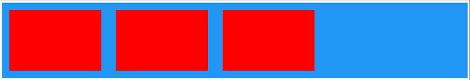
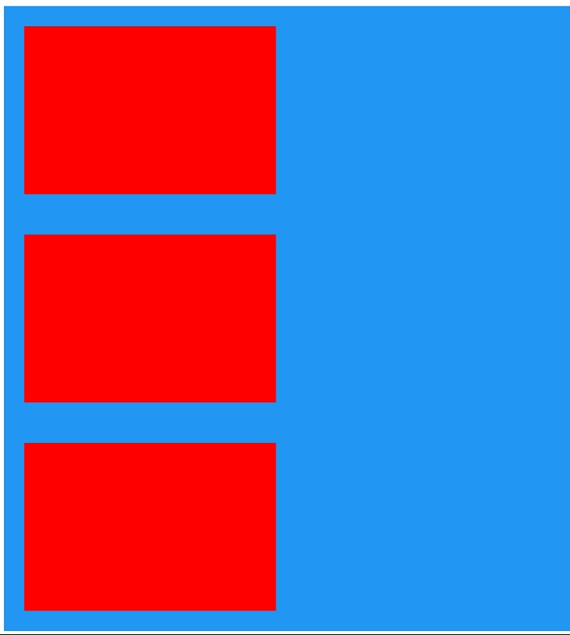
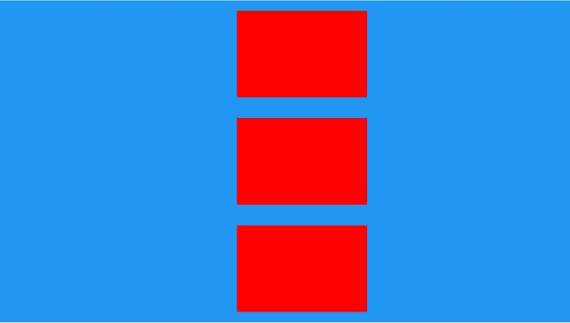
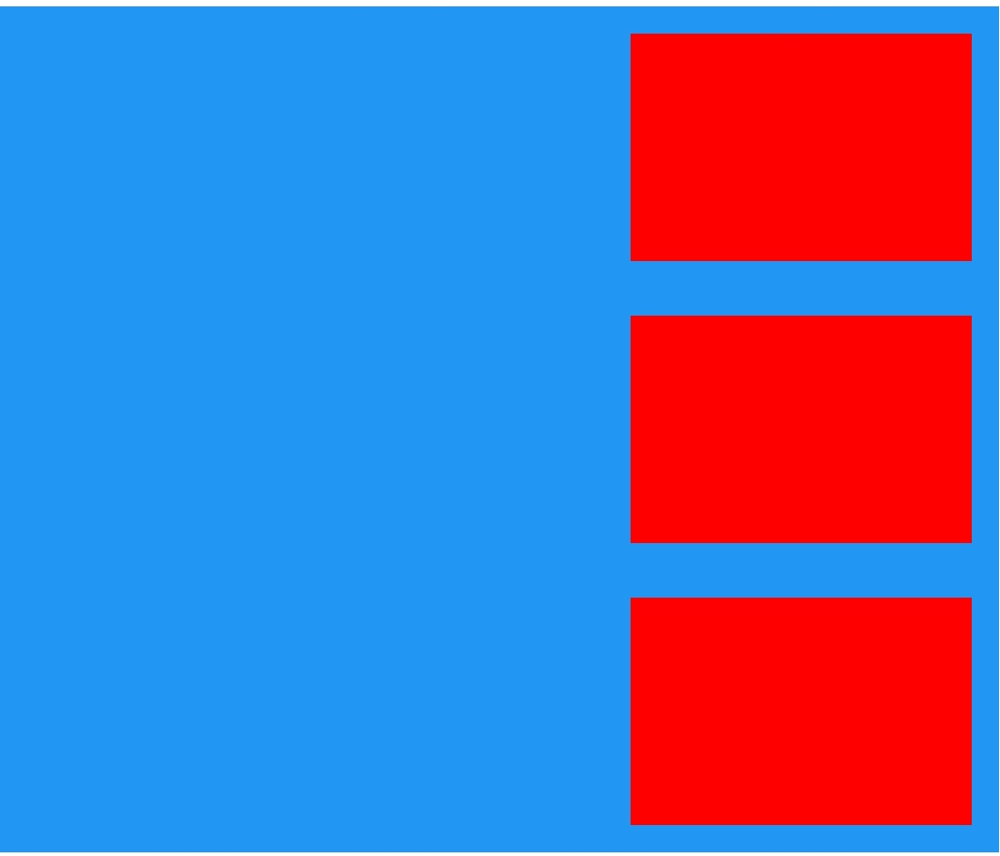
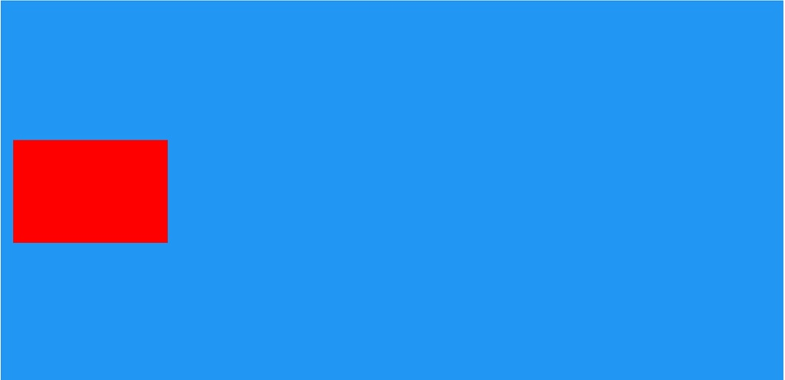

## Positivo Framework


# Sistema de posicionamento em Flex Box

o sistema de grids criado leva em consideração as últimas novidades dos sistemas de grids antigos e a aplicação dos conceitos de flexbox atuais.

O posicionamento dos itens na tela dependem do entendimento do conceito aqui empregado.

* Grid 
O grid é o termo usado para o container.

O *Container* possui responsabilidade sobre os itens filhos diretos.

* Célula
Entendemos como célula um item que é filho e respeita as diretivas de um pai *Grid*

O Grid sempre virá indicando se seus filhos serão posicionados em *colunas* ou em *linhas*.

* As classes do grid incorporam conceitos de responsividade 
Classes com o sufixo *-sm* indicam que sua regra é valida para dispositivos mobile ou superiores. 
Classes com o sufixo *-md* indicam que sua regra é valida **somente** para dispositivos tablets ou superiores. Este conceito continua com *-lg*.
As classes de responsividade são explicadas mais adiante.

# Classes do Grid

## g-columns-sm ou g-rows-sm

**g-column-sm** : serve para indicar que o item atual é um container que agrupa suas células em colunas (Cada filho em uma coluna dinâmica)

**g-rows-sm** : serve para indicar que a item atual é um container que agrupa suas células em linhas (cada filho em uma linha)

## c
    c : Representam as células de um grid

Exemplo:

Grid em <span style="color:blue">azul</span> 

Células em <span style="color:red">vermelho</span> 

Exemplo:
A
```xml

  <div class="g-columns-sm bg-color-primary">
        <!--1 coluna-->
        <div class="c wrapper-24">
            <div class="test-card"> </div>
        </div>

        <div class="c wrapper-24">
            <div class="test-card"> </div>
        </div>

        <div class="c wrapper-24">
            <div class="test-card"> </div>
        </div>

    </div>
```
A: em colunas



B

```xml

 <div class="g-rows-sm  bg-color-primary">
        <!--1 coluna-->
        <div class="c wrapper-24">
            <div class="test-card"> </div>
        </div>

        <div class="c wrapper-24">
            <div class="test-card"> </div>
        </div>

        <div class="c wrapper-24">
            <div class="test-card"> </div>
        </div>

    </div>
```
B: em linhas

 
# Alinhamento
O sistema de grid smepre procura alinhar os itens dem um determinado eixo, definidos em horizontal e vertical.  
( independente se está em *colunas* ou em *linhas*)

Isto significa que antes de definir o alinhamento, você deve definir em qual eixo deseja aplicar a propriedade de alinhamento

Exemplo:
```xml
g-horizontal-center-sm
```
* Alinhamento *horizontal* e *centralizado*

```xml
<div class="g-rows-sm g-horizontal-center-sm  bg-color-primary">
        <!--1 coluna-->
        <div class="c wrapper-24">
            <div class="test-card"> </div>
        </div>

        <div class="c wrapper-24">
            <div class="test-card"> </div>
        </div>

        <div class="c wrapper-24">
            <div class="test-card"> </div>
        </div>

    </div>
```

C: Centralizados no centro 



--


```xml
g-horizontal-end-sm
```

```xml
<div class="g-rows-sm g-horizontal-end-sm  bg-color-primary">
        <!--1 coluna-->
        <div class="c wrapper-24">
            <div class="test-card"> </div>
        </div>

        <div class="c wrapper-24">
            <div class="test-card"> </div>
        </div>

        <div class="c wrapper-24">
            <div class="test-card"> </div>
        </div>

    </div>
```
D: Centralizados no fim (end) 



```xml
g-vertical-center-sm
```

```xml

    <div class="g-rows-sm g-vertical-center-sm  bg-color-primary g-full-h">
        <!--1 coluna-->
        <div class="c wrapper-24">
            <div class="test-card"> </div>
        </div> 
    </div>

```
D: Vertical / Centralizado 



-------------------
```xml
g-vertical-end-sm
```

```xml

     <div class="g-rows-sm g-vertical-end-sm  bg-color-primary g-full-h">
        <!--1 coluna-->
        <div class="c wrapper-24">
            <div class="test-card"> </div>
        </div> 
    </div>

```
D: Vertical / End 


## Juntando as propriedades de alinhamento Horizontal e Vertical
```xml
g-vertical-end-sm
```

```xml

     <div class="g-rows-sm g-vertical-center-sm g-horizontal-end-sm bg-color-primary g-full-h">
        <!--1 coluna-->
        <div class="c wrapper-24">
            <div class="test-card"> </div>
        </div> 
    </div>

```
E: Vertical-Center / Horizontal-End 


## Exemplos
Para facilitar o entendimento, vamos criar um componente simples de lista para fixar melhor os conceitos.

Criaremos um item de lista com uma imagem, um título e uma descrição
```xml

     <div class="g-rows-sm">

        <!--Uma Linha-->
        <div class="c ">

            <!-- Dividindo a linha em duas colunas-->
            <div class="g-columns-sm g-vertical-center-sm">
                
                <!--Coluna A -->
                <div class="c ">
                    
                </div>

                <!--Coluna B-->
                <div class="c ">
                    <!--A Coluna B é divida novamente em duas linhas-->
                    <div class="g-rows-sm">
                        <!--Linha do Titulo-->
                        <div class="c">Titulo</div>
                        <!--Linha da descrição-->
                        <div class="c">Descrição bla bla bla bla</div>
                    </div>
                </div>
            </div>
        </div> 
        
    </div>

```
Compose: 


