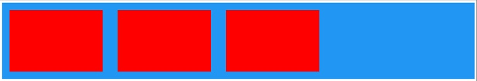
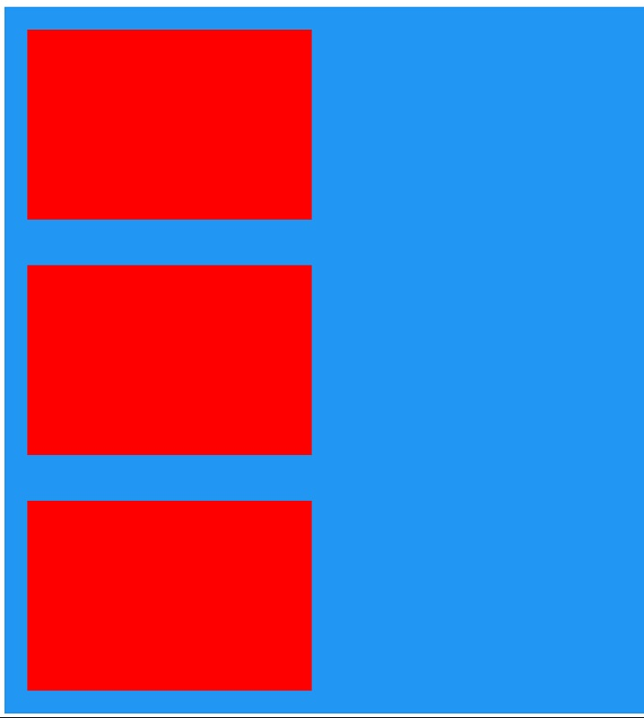
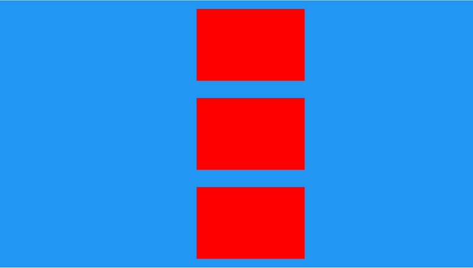

# Sistema de posicionamento em Flex Box

o sistema de Grids criado leva em consideração as últimas novidades dos sistemas de grids antigos e a aplicação de dos conceitos de flexbox atuais.

o Posicionamento dos itens na tela dependem do entendimento do conceito aqui empregado.

* Grid
O grid é o termo usado para o coantainer.
O *Container* possui responsabilidade sobre os itens filhos diretos.

* Célula
Entendemos como célula um item que é filho e respeita as diretivas de um pai *Grid*

O Grid sempre virá indicando se seus filhos serão posicionados em *colunas* ou em *linhas*.

* As classes do grid incorporam conceitos de responsividade 
Classes com o sufixo *-sm* indicam que sua regra é valida para dispositivos mobile ou superiores. Este conceito continua com *-md* (Tablets) e assim por diante...

# Classes do Grid

## g-columns-sm ou g-rows-sm

    g-column-sm : serve para indicar que a div atual é um container que agrupa suas células (filhos) em colunas

    g-rows-sm : serve para indicar que a div atual é um container que agrupa suas células (filhos) em colunas


## c
    c : Representam as células de um grid

Exemplo:

Grid em <span style="color:blue">azul</span> 

Células em <span style="color:red">vermelho</span> 

Exemplo:
A
```xml

  <div class="g-columns-sm bg-color-primary">
        <!--1 coluna-->
        <div class="c wrapper-24">
            <div class="test-card"> </div>
        </div>

        <div class="c wrapper-24">
            <div class="test-card"> </div>
        </div>

        <div class="c wrapper-24">
            <div class="test-card"> </div>
        </div>

    </div>
```
A: em colunas



B

```xml

 <div class="g-rows-sm  bg-color-primary">
        <!--1 coluna-->
        <div class="c wrapper-24">
            <div class="test-card"> </div>
        </div>

        <div class="c wrapper-24">
            <div class="test-card"> </div>
        </div>

        <div class="c wrapper-24">
            <div class="test-card"> </div>
        </div>

    </div>
```
B: em linhas

 
# Alinhamento
O sistema de grid smepre procura alinhar os itens dem um determinado eixo, definidos em horizontal e vertical.  
( independente se está em *colunas* ou em *linhas*)

Isto significa que antes de definir o alinhamento, você deve definir em qual eixo deseja aplicar a propriedade de alinhamento

Exemplo:
```xml
g-horizontal-center-sm
```
* Alinhamento *horizontal* e *centralizado*

```xml
<div class="g-rows-sm g-horizontal-center-sm  bg-color-primary">
        <!--1 coluna-->
        <div class="c wrapper-24">
            <div class="test-card"> </div>
        </div>

        <div class="c wrapper-24">
            <div class="test-card"> </div>
        </div>

        <div class="c wrapper-24">
            <div class="test-card"> </div>
        </div>

    </div>
```

C: Centralizados no centro 
